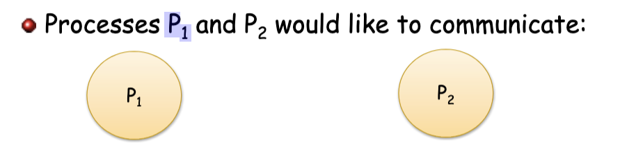
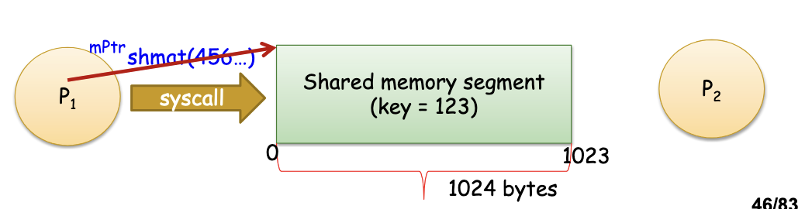
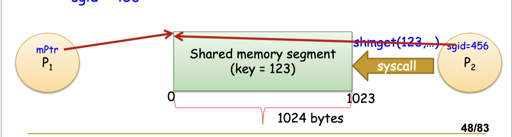
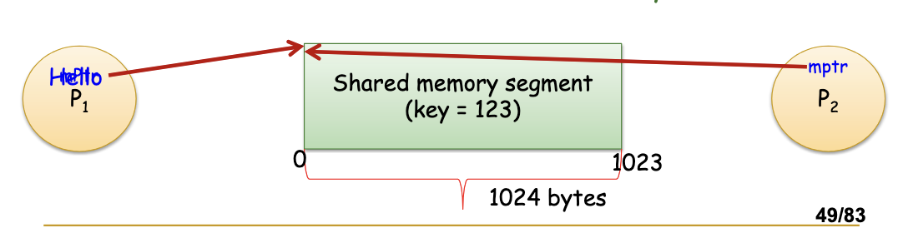
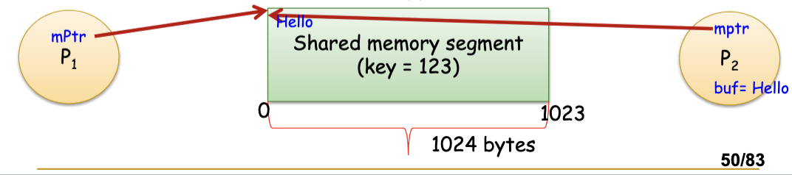

# 9/12
## Interprocess Communication: 
### IPC examples: System V Message Queues

When having two processes that want to communicate with message V queues


1. Process P <sub>1</sub> invokes: <br>
```
sgid = shmget(key,size, S_IRUSR | S_IUWSr | IPCS_CREAT) 
where key = 123 and size = 1024
```
<br>
2. Process P <sub>1</sub>  invokes: <br><br>
`mPtr = (char*)shmat(sgid,NULL,0);`
<br>
<br>
3. Process P <sub>2</sub>  invokes: <br>
```
sgid = shmget(key,size,S_IRUSR |S_IWUSR) 
where key = 123 and size = 1024 
```
<br>

4. Process P <sub>2</sub>  invokes: <br>
```
mPtr = shmat(sgid,NULL,0) where key = 123, size = 1024 and sgid = 456
```

<br><br>
5. Process P <sub>1</sub>  invokes: <br>
`strncpy(mPtr,"Hello", 6);`<br>
This copies a 6 character string "Hello" to shared memory
<br><br>
6. Process P <sub>2</sub>  invokes: <br> 
`strncpy(buf,mPtr, 6);`<br> 
This copies the 6 character string "Hello" from shared 
memory to local array buffer
<br>
## Methods

**Writing to shared memory:**<br>
`spritf(shared_memory, "Hello world");`

**Detaching shared memory:**<br>
`shmdt(shared_memory);`

**Deallocating shared memory segment:**<br>
`shmctl(segment_id, TPC_RMID,...);`


