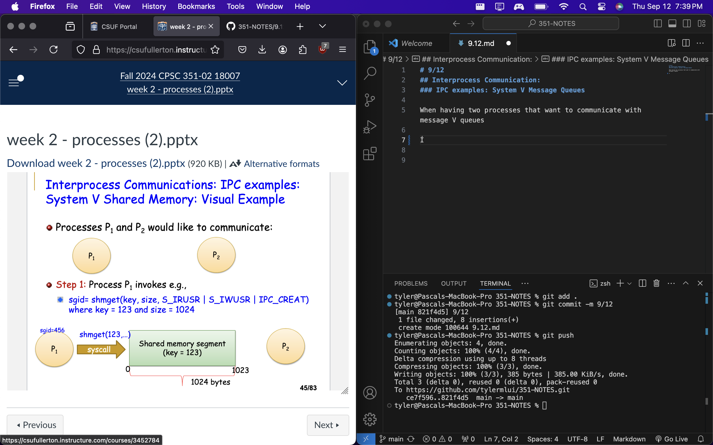

# 9/12
## Interprocess Communication: 
### IPC examples: System V Message Queues

When having two processes that want to communicate with message V queues


1. Process P <sub>1</sub> invokes: <br>
```
sgid = shmget(key,size, S_IRUSR | S_IUWSr | IPCS_CREAT where) 
where key = 123 and size = 1024
```

2. Process P <sub>1</sub>  invokes: <br>
`mPtr = (char*)shmat(sgid,NULL,0);`


